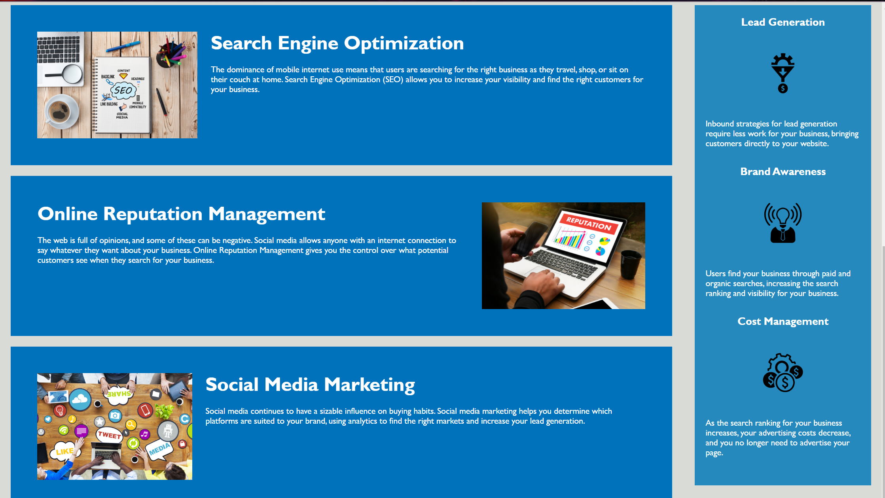

# Code-Refactor

## Description

This assignment was an assignment given to us to refactor a webpage so that the links a client would see are functional. As well as ensure the CSS is consolidated correctly.

### Installing

No installation needed.

## Screenshot of site

## Built With

* [HTML](https://developer.mozilla.org/en-US/docs/Web/HTML)
* [CSS](https://developer.mozilla.org/en-US/docs/Web/CSS)

## Deployed Link

* [See Live Site]()

## Authors

* **George Sandoval** 

- [Link to Portfolio Site](https://gsandoval09.github.io/UpdatedProfessionalPortfolio/)
- [Link to Github](https://github.com/gsandoval09)
- [Link to LinkedIn](www.linkedin.com/in/george-sandoval-4467641b3)

## License

This project is licensed under the MIT License 

## Acknowledgments

* Google
* w3schools
* Mozilla
